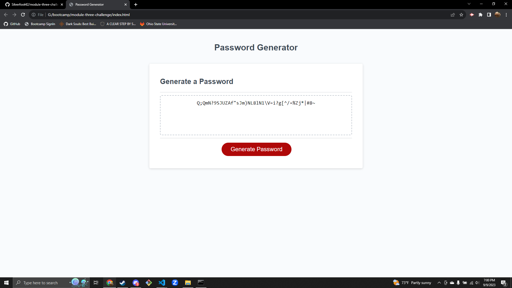

# module-three-challenge

## Description

The finished solution for the challenge included in module 3. The website is a password generator.

## Screenshot

## Deployment link:

https://silverfoot42.github.io/module-three-challenge/

## Credits

Classmate Grant Wolff help with the code for the random generator:

  for (var x = 0; x < length; x++) {
    var character = Math.floor(Math.random() *generate.length + 1);
    password += generate.charAt(character);
  }